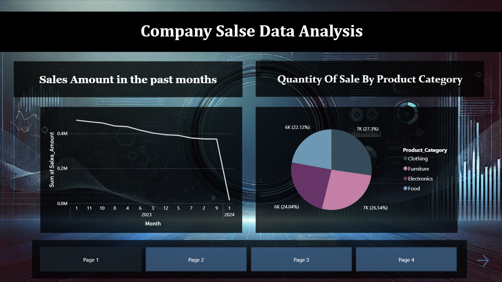
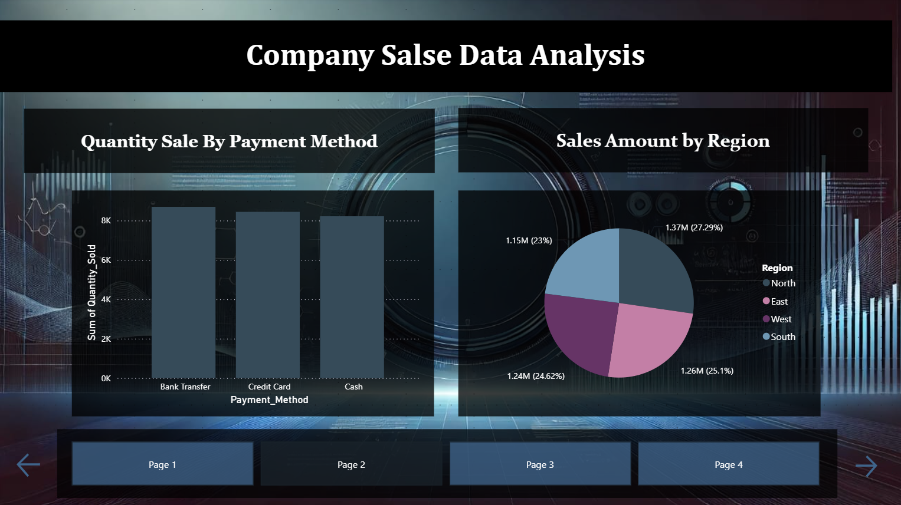
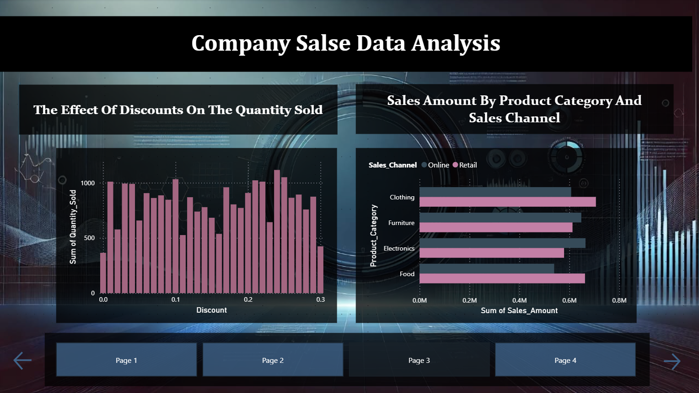
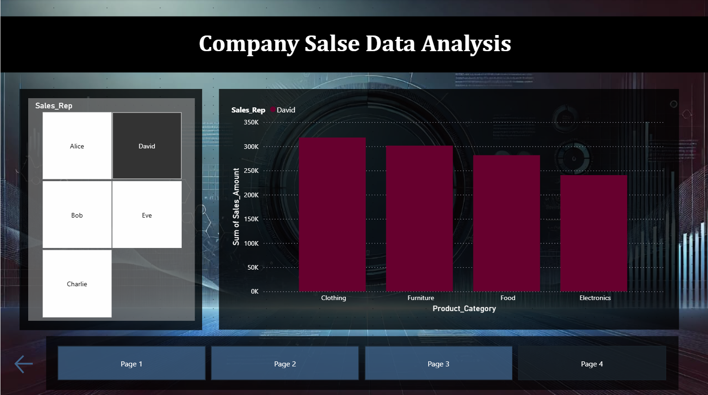

# Sales Performance Dashboard

An interactive **Power BI dashboard** designed to analyze sales performance through clear visualizations and interactive reports. The dashboard helps users monitor trends, compare sales across different categories, and explore business data using dynamic filters.

---

## Project Overview

This project demonstrates how Power BI transforms raw sales data into meaningful business insights through interactive visualizations and dashboards. The report is designed with multiple interactive pages that provide both high-level summaries and detailed analysis, helping stakeholders understand sales performance and make informed business decisions.

### Key Objectives
- Monitor overall sales performance.
- Analyze sales trends over time.
- Compare performance across different categories.
- Explore sales data through interactive filters.
- Support data-driven decision making.

---

## Dashboard Pages

### 1. Sales Overview

---

### 2. Sales Comparison

---

### 3. Detailed Analysis

---

### 4. Interactive Report

---

## Features

- Interactive dashboard
- Multi-page report
- Clean and responsive layout
- Dynamic filtering using slicers
- Business-oriented visualizations
- Easy page navigation

---

## Tools & Technologies

- Microsoft Power BI Desktop
- Data Visualization
- Dashboard Design
  
---
## Team Members

- Raghad Oteef (GitHub: https://github.com/raghad-o)
- Wejdan Hakami (GitHub: https://github.com/wejdan-h)
